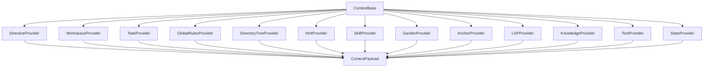

# Context & State Management

How Aura OS assembles the "Agent Mind" (the context) and manages runtime memory and instruction prompts.

**Framework Code**: `src/core/context/` (base, manager, payload, assembler, providers/*)  
**Project Context**: `state/sessions/*.db` (SQLite, session-isolated), `.aura_knowledge.json`, `SOUL.md`, `AGENTS.md`, `USER.md`, `TOOLS.md`, `IDENTITY.md`, `MEMORY.md`, `memory/*.md`, `task.md` and `config/config.yml`  
**Memory Metabolism**: `src/core/memory/metabolizer.ts`

---

## Mental Model: Prompt, EnvProvider, & Memory

Aura OS conceptualizes the assembled agent context into three primary pillars to structure the agent's mind and state:

```
┌────────────────────────────────────────────────────────────────────────┐
│                              Agent Context                             │
└───────────────┬───────────────────────┼────────────────────────┬───────┘
                │                       │                        │
                ▼                       ▼                        ▼
      ┌──────────────────┐    ┌──────────────────┐     ┌──────────────────┐
      │      Prompt      │    │   EnvProvider    │     │      Memory      │
      │  (Directives/    │    │   (Objective     │     │ (Runtime state & │
      │   instructions)  │    │  workspace facts)│     │ SQLite database) │
      └────────┬─────────┘    └────────┬─────────┘     └────────┬─────────┘
               │                       │                        │
     ┌─────────┼─────────┐   ┌─────────┼─────────┐              │
     ▼         ▼         ▼   ▼         ▼         ▼              ▼
  Kernel   Workspace   Task Env      LSP     Knowledge        State
  Prompt    Prompt    Prompt Overview Details  Database       History
```

1. **Prompt (指令性提示词)**:
   - **Kernel Prompt (内核级提示词)**: Core system protocols and constraints defined by the Aura global registry. These enforce format constraints (such as strict JSON output rules) and cannot be modified by the agent project.
   - **Workspace Prompt (工作区级提示词)**: Custom instructions and guidelines defined within the user's workspace (such as `SOUL.md`, `AGENTS.md`, and specific workflow `SKILL.md` configurations). These are fully editable by the user.
   - **Task Prompt (任务目标提示词)**: Current action plan and checkpoint goals (derived from `task.md` checklists).

2. **EnvProvider (客观环境与事实)**:
   - **Env Overview**: Current directory listing, ignored patterns, active tag hints (`@aura-hint`), and garden playbooks.
   - **LSP Diagnostics**: Live code health statistics and compilation issues returned by the language server.
   - **Knowledge Base**: Passive file indices and companion hints inside the `knowledge/` directory.

3. **Memory (动态运行时记忆)**:
   - **State**: Runtime active variables, tool execution logs, SQLite event history, and metabolic context summaries.

---

## Context Assembly Pipeline

The `ContextBase` (`src/core/context/base.ts`) orchestrates multiple providers to build the prompt. Each provider has a single responsibility and generates a specific section of the markdown context payload.

The pipeline comprises distinct providers located in `src/core/context/providers/`:



### 1. Directive Provider (`DirectiveProvider`)

Resolves the core system instructions and guidelines that govern the agent's behavior.

**Features:**
- **Modular System Prompts**: Combines modular default files from the framework prompts directory.
- **Skill-Based Operating Protocol**: If an active workflow skill is specified, loads its corresponding `SKILL.md` template.
- **Legacy Single-File Directives**: Detects and loads workspace overrides like `skills/system.md` or `.aura-workspace/skills/system.md`.
- **Ralph Loop Support**: Resolves specialized prompts for Ralph developer (`:ralph_developer`) and critic (`:ralph_critic`) execution modes, loading corresponding workspace rules or falling back to default loop instructions.
- **Template Substitution**: Automatically interpolates `{{project_path}}` in instructions.

### 2. Workspace Provider (`WorkspaceProvider`)

Loads markdown configuration files from the project workspace or `.aura-workspace/prompts/system/` / `prompts/system/` subdirectories to guide agent persona, rules, and long-term memory.

**Files Scanned:**
- **`SOUL.md`** (`# AGENT PERSONA (SOUL)`): Defines the persona, tone, style guidelines, and boundaries.
- **`AGENTS.md`** (`# OPERATING INSTRUCTIONS`): Lists developer-defined operating rules and constraints.
- **`USER.md`** (`# USER CONTEXT`): Tailors interactions according to user profile and preferences.
- **`TOOLS.md`** (`# TOOL GUIDELINES`): Outlines custom instructions or tips for tool execution.
- **`IDENTITY.md`** (`# AGENT IDENTITY`): Defines self-concept, agent name, and preferred emojis.
- **`MEMORY.md`** (`# LONG-TERM MEMORY`): Retains curated, high-level, persistent memories.
- **`memory/*.md`** (`# RECENT MEMORY LOGS`): Loads the contents of the last two daily memory log files.

### 3. System & Environment Composition

The `# SYSTEM & ENVIRONMENT` section is compiled directly by `ContextBase` utilizing several specialized sub-providers to present environmental, workspace structure, and tag-sensing capabilities:

**Subsections & Contributors:**
- **Global Rules**: Handled by `GlobalRulesProvider`. Loads project-specific `AURA_README.md` instructions and user-global guidelines from `~/.aura-framework/global_hint.md`.
- **Workspace Overview**: Handled by `DirectoryTreeProvider`. Displays a recursive list of files and directories up to `directory_tree.max_depth` (default 3) levels deep, showing at most `directory_tree.max_files_per_dir` (default 10) files per directory to prevent context bloat.
- **Active Tags & Guidance (`@aura-hint`)**: Handled by `HintProvider`. Scans workspace files ending in `.py`, `.rb`, `.sh`, `.md`, or `.txt` (up to 100KB in size and 1000 files total) up to `hints.max_scan_lines` lines deep (default 2000) for comments matching the `@aura-hint:` pattern. **It also scans the entire workspace for sidecar `.hint` files (e.g. `src/core/parser.ts.hint`)** outside of the `knowledge/` directory, loading their entire contents as active constraints.
- **Skills Knowledge**: Handled by `SkillProvider`. Parses YAML metadata from `SKILL.md` files (in `skills/` or `.aura-workspace/skills/`) to display skill name, description, requirements, and missing workspace tools, plus lists related scripts, references, and assets.
- **Garden Playbooks**: Handled by `GardenProvider`. Surfaces active playbooks and garden rules.
- **User Tasks**: Handled by `AnchorProvider`. Extracts the current plan stored as active variables in the SQLite database and summarizes node actions from `anchors/*.json` or `anchors/*.yaml` / `anchors/*.yml` files.

### 4. Knowledge Provider (`KnowledgeProvider`)

Indexes the passive documentation and data library in the `knowledge/` directory.

**Features:**
- **Workspace Knowledge Index**: Lists all files and subdirectories within the `knowledge/` directory, ensuring the Agent is aware of the existence of references, guides, or datasets so it can decide to read them when needed.
- **Companion `.hint` Files**: If a file `knowledge/X` has a companion `knowledge/X.hint` sidecar file, `KnowledgeProvider` reads it and appends it as `(Context: <content>)` directly in the compiled index. This allows the Agent to grasp the contents of binary files (like PDFs) or massive documents without loading them entirely into context.
- **Distinction from HintProvider**: Unlike `HintProvider` which gathers active, mandatory execution constraints (e.g. "Do not write allocations"), `KnowledgeProvider` provides a directory catalog of passive information assets. This prevents the Agent from treating reference documents as active directives. These are injected under the `# PROJECT KNOWLEDGE BASE` header.

### 5. LSP Provider (`LSPProvider`)

Retrieves compiler and linter warnings or errors from the LSP Manager. It lists active diagnostics under `# CODE HEALTH (LSP Diagnostics)` and displays the line number and message of the first three errors in affected source files to prevent agent logic degradation.

### 6. Tool Provider (`ToolProvider`)

Exposes local, MCP, and LSP diagnostic tools under `# ACTIVE TOOLS` and `# TOOL INDEX`.

**Features:**
- **Lifecycle & Context Isolation**: Performs sliding TTL maintenance on active contexts. Discovers subtools which specify `requires_context` and unlocks them only if corresponding instances exist in the context manager.
- **JSON Schema Construction**: Collects input schema definitions, descriptions, hints, and required fields.
- **Integration**: Appends MCP tools (`mcp.<server>.<tool>`) and LSP diagnostic execution hooks.

### 7. Task Provider (`TaskProvider`)

Resolves the `task.md` file from the workspace path, placing it under the `# LONG-RUN TASK` header to track current goals and sub-steps during long-duration runs.

### 8. State Provider (`StateProvider`)

Pulls session history and system variables from the active session SQLite database.

**Features:**
- **Active Variables**: Lists active variables and tool status/error flags (`tool_status:<name>`, `tool_error:<name>`).
- **Chronological History**: Collects and formats history events (`user` inputs, `plan` decisions, and `execution` results) sequentially.
- **Event Merging & Formatting**: Merges identical consecutive lines and flags repetition count (e.g. `(x5)` suffix). Adds timestamps selectively to events if the temporal gap between consecutive events exceeds a configurable threshold (default 60 seconds).

---

## LLM Context & Prompt Composition

### Payload LLM Methods

The `ContextPayload` class represents the aggregated sections and structured tool listings, supporting customizable prompt construction options.

**Location**: `src/core/context/payload.ts`

---

## Context Compression

If the assembled prompt context exceeds the configured `state_management.max_state_chars` limit (from `config.yml`), the system applies multi-tiered compression strategies during `ContextBase#assemble`:

1. **Event Payload Truncation**: Truncates individual history event payloads to a maximum character size defined by `context_compression.event_max_chars` (default 800).
2. **History Event Count Reduction**: Sequentially drops older events until the context fits or the remaining events count hits `context_compression.event_min_count_threshold` (default 10).
3. **Step-wise History Trim**: Trims history events in steps of `context_compression.summary_trim_step` (default 5).
4. **Section Discarding**: Drops entire optional context sections one by one in the following drop order priority until the length is under the limit:
   - `lsp`
   - `env`
   - `tools`
5. **Aggressive History Trim**: Drops history events down to a single latest event.
6. **Failure Guard**: If the compressed context still exceeds the limit, records the error in the session summaries table and raises a `ContextOverflowError`.

---

## Tool Context Lifecycle Manager

The `ContextManager` handles temporary context environments.

**Location**: `src/core/context/manager.ts`  
**Purpose**: Registers, updates, and expires sliding tool contexts in `state/tool_contexts.json`.

Tools can dynamically request or register context structures:
- **`creates_context`**: Creates a temporary state/context identifier.
- **`requires_context`**: Restricts tool visibility so the tool is only usable when a specific context is active.
- **TTL Expiration**: Expired contexts are pruned automatically on each turn based on sliding window definitions (turns elapsed or seconds elapsed, using "any" or "all" TTL policies).

---

## Database Schema (SQLite)

Each session database contains:

### events table
- `id` - Auto-increment primary key
- `timestamp` - Unix timestamp
- `phase` - Event phase (user/plan/execution/observe/learn/interception)
- `tool` - Tool name (nullable)
- `payload` - JSON payload with event details

### summaries table
- `id` - Auto-increment primary key
- `timestamp` - Unix timestamp
- `content` - Summary text
- `source_event_id` - Link to originating event (for Call Summaries)

### variables table
- `key` - Primary key (string)
- `value` - JSON/Text value

---

## Code References

- **Context Base**: `src/core/context/base.ts`
- **Payload Module**: `src/core/context/payload.ts`
- **Directive Provider**: `src/core/context/providers/directiveProvider.ts`
- **Workspace Provider**: `src/core/context/providers/workspaceProvider.ts`
- **Task Provider**: `src/core/context/providers/taskProvider.ts`
- **Global Rules Provider**: `src/core/context/providers/globalRulesProvider.ts`
- **Knowledge Provider**: `src/core/context/providers/knowledgeProvider.ts`
- **LSP Provider**: `src/core/context/providers/lspProvider.ts`
- **Tool Provider**: `src/core/context/providers/toolProvider.ts`
- **State Provider**: `src/core/context/providers/stateProvider.ts`
- **Context Manager**: `src/core/context/manager.ts`
- **Session Manager**: `src/core/memory/sessionManager.ts`

---

## See Also

- [Memory Management](memory-management.md) - Metabolism and retention
- [Session Architecture](session-architecture.md) - Session isolation
- [Architecture Overview](architecture.md) - System design
- [Skills and Tools](../user-guide/skills-and-tools.md) - Tool manifest & @aura-hint usage
