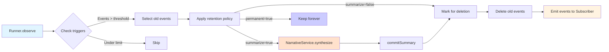

# Memory Management

Aura implements a sophisticated memory metabolism system with tiered retention strategies and dual summary mechanisms.

---

## Tiered Retention Strategy

Aura uses 4 retention tiers for different event types:

| Tier | Name | Events | Retention | Summarize |
|------|------|--------|-----------|-----------|
| 1 | Ephemeral | execution, observe | Configurable max_steps | Only `execution` (`observe` is ❌ No) |
| 2 | Working | plan, user | Configurable max_steps | ❌ No |
| 3 | Insights | learn, interception | Configurable max_steps | Only `learn` (`interception` is ❌ No) |
| 4 | Permanent | milestone | Forever | ❌ No |

**Implementation Note**: The `max_steps` field configures the maximum count of recent events to keep in active memory for each event category (or specific tool). During metabolism, events of a category exceeding its configured `max_steps` threshold are processed for summarization and deletion, ensuring the active context length remains within boundaries.

---

## Configuration Sources (Priority Order)

### 1. Tool Manifest (Highest Priority)

```json
{
  "name": "bash_command",
  "memory": {
    "retention": "ephemeral",
    "summarize": true,
    "max_steps": 5
  }
}
```

### 2. Global Config (`config.yml`)

```yaml
state_management:
  retention:
    execution: { max_steps: 10, summarize: true }
```

### 3. Code Defaults (`src/core/memory/policy.ts`)

---

## Metabolism Process



## Memory Architecture

The memory module is decoupled from the Kernel layer and is divided into modular classes managed under `src/core/memory/`:

### 1. MemoryBase (Core Hub)
- **Location**: `src/core/memory/base.ts`
- Orchestrates and holds references to all memory components: `recorder`, `provider`, `metabolizer`, and `store`.
- Exposes direct delegate methods like `undo` and `redo` to simplify Kernel access.

### 2. Recorder (Write Side)
- **Location**: `src/core/memory/recorder.ts`
- Provides structured methods to record events for various phases (`recordUser`, `recordPlan`, `recordExecution`, `recordInterception`, `recordCustom`) and summaries (`recordSummary`).
- Supports atomic transaction recording of batch events (`recordBatch`).

### 3. Provider (Read Side)
- **Location**: `src/core/memory/provider.ts`
- Reads recent events, summaries, and variables from the memory store.
- Formats active variables and converts chronological histories into markdown prompts for LLM consumption.

### 4. Metabolizer Class (Event Lifecycle)
- **Location**: `src/core/memory/metabolizer.ts`  
- **Called from**: `Runner.observe` before context assembly.
- Triggers periodically when event threshold is reached, applying the retention policy, calling the summarizer, and deleting expired events.
- **Event Bus Emits:**
  - `metabolism_start` - Metabolism begins
  - `metabolism_summary` - Summary generated
  - `metabolism_complete` - Metabolism finishes

### 5. SQLiteStore (Persistence)
- **Location**: `src/core/memory/sqliteStore.ts`
- Implements thread-safe, transaction-supported persistence using SQLite3 database connections via `better-sqlite3`.
- Manages `events`, `summaries`, `variables`, and `undone_` tables for rollback control.

---

## Two Types of Summaries

Aura uses two distinct summary mechanisms:

### Call Summary (工具调用摘要)

**Source**: LLM returns `summary` field in tool call response  
**Timing**: Every tool execution  
**Config**: `tool_protocol.call_summary.*`  
**Purpose**: Quick record of "what agent did"  
**Example**: `"读取配置文件检查数据库设置"`

### Metabolism Summary (代谢总结)

**Source**: NarrativeService calls LLM to generate narrative  
**Timing**: When metabolism is triggered (events exceed threshold)  
**Config**: `state_management.summarization.*`  
**Purpose**: Compress old events into concise narrative  
**Example**: `"Agent read config.yml, attempted to write test.ts but failed due to syntax error, then fixed and verified."`

---

## Summary Comparison

| Feature | Call Summary | Metabolism Summary |
|---------|--------------|-------------------|
| **Source** | LLM tool call return | NarrativeService generates |
| **Timing** | Every tool execution | When metabolism triggered |
| **Length** | 120-256 chars | Up to 500 chars |
| **Content** | "What was done" | "What progress happened" |
| **Config** | `tool_protocol.call_summary.*` | `state_management.summarization.*` |
| **Retention** | Unaffected | Based on retention tiers |
| **Events** | None | metabolism_start/complete |
| **LLM Call** | Included in plan | Additional LLM call |

---

## Complete Memory Lifecycle

```
User Input
  ↓
Plan (LLM returns tool call + summary)
  ↓
Execute Tool
  ↓
Call Summary → commitSummary()  ← First summary type
  ↓
Metabolizer checks if metabolism needed
  ↓
If needed:
  ├─ Select old events
  ├─ Apply retention policy
  ├─ NarrativeService.synthesize()
  ├─ Metabolism Summary → commitSummary()  ← Second summary type
  └─ Delete old events
  ↓
Provider reads:
  ├─ Recent events (chronological)
  └─ Recent summaries (call summaries + metabolism summaries)
  ↓
Assembled into Context for LLM
```

---

## Configuration Examples

### Development Environment (Fast Iteration)

```yaml
state_management:
  max_state_chars: 50000          # Lower threshold, frequent metabolism
  recent_events_n: 10             # Keep fewer events
  
  summarization:
    enabled: true
    max_chars: 300                # Shorter summaries
  
  retention:
    execution:
      max_steps: 3                # Delete quickly
      summarize: true
```

### Production Environment (Retain More History)

```yaml
state_management:
  max_state_chars: 200000         # Higher threshold
  recent_events_n: 50             # Keep more events
  
  summarization:
    enabled: true
    max_chars: 800                # Longer summaries
  
  retention:
    execution:
      max_steps: 10               # Retain more
      summarize: true
    plan:
      max_steps: 100              # Long-term plan retention
```

### Debug Mode (Keep Everything)

```yaml
state_management:
  max_state_chars: 1000000        # Almost never triggers
  recent_events_n: 200            # Keep large amount of events
  
  summarization:
    enabled: false                # Disable metabolism summaries
  
  retention:
    execution:
      max_steps: 1000
      summarize: false
```

---

## Configuration Reference

### state_management (config.yml)

```yaml
state_management:
  max_state_chars: 100000           # Trigger metabolism at this char count
  recent_events_n: 20               # Keep this many recent events
  keep_last_summary_n_steps: 20     # Keep this many recent summaries
  
  summarization:
    enabled: true
    max_chars: 500                  # Max length for metabolism summaries
    model: "gpt-4o"                 # Optional: specific model for summaries
    focus_on:                       # Summary focus areas
      - "key_files_modified"
      - "critical_test_results"
      - "blockers_encountered"
      - "cumulative_result"
  
  retention:
    execution: { max_steps: 5, summarize: true }
    observe: { max_steps: 3, summarize: false }
    plan: { max_steps: 50, summarize: false }
    user: { max_steps: 100, summarize: false }
    learn: { max_steps: 200, summarize: true }
    interception: { max_steps: 100, summarize: false }
    milestone: { permanent: true }
```

### tool_protocol.call_summary (config.yml)

```yaml
tool_protocol:
  call_summary:
    max_chars: 256                  # Max summary length (truncate if exceeded)
```

### memory field (manifest.json)

```json
{
  "memory": {
    "retention": "ephemeral",
    "summarize": true,
    "max_steps": 5,
    "permanent": false,
    "description": "Optional human-readable description"
  }
}
```

---

## Future Extensions

### 1. Intelligent Retention Policy

```typescript
// AI marks important events as milestone
if (eventIsCritical(event)) {
  tagAsMilestone(event);  // Never deleted
}
```

### 2. Multi-Level Metabolism

```
Level 1: Detailed summary (500 chars) - Retain 100 steps
Level 2: Condensed summary (200 chars) - Retain 500 steps
Level 3: One-line summary (50 chars)  - Permanent retention
```

### 3. Cross-Session Memory

```typescript
// Important insights stored in variables table, retained across sessions
state.setVariable("insight:auth_bug", "JWT token needs refresh");
```

---

## Code References

- **Memory::Metabolizer**: `src/core/memory/metabolizer.ts`
- **NarrativeService**: `src/core/kernel/narrativeService.ts`
- **StateProvider**: `src/core/context/providers/stateProvider.ts`
- **Tests**: `tests/integration/kernel.test.ts`

---

## See Also

- [Context & State](context-and-state.md) - State management
- [Architecture Overview](architecture.md) - System design
- [Configuration](../user-guide/configuration.md) - User configuration guide
