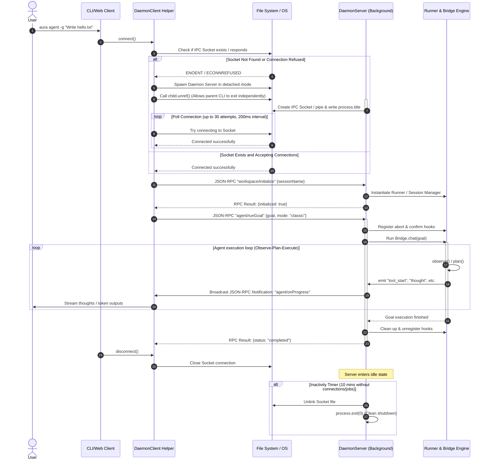
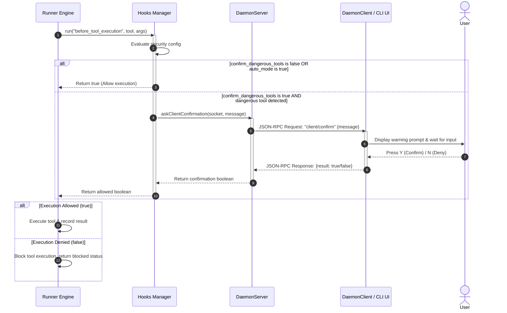

# Daemon Architecture

This document describes the design, implementation, and architectural rationale behind the **Aura Daemon** system in the TypeScript framework.

**Framework Code**: `src/daemon/` ([ipc.ts](file:///Users/frank/Desktop/Towards%20AGI/aura/aura/src/daemon/ipc.ts), [server.ts](file:///Users/frank/Desktop/Towards%20AGI/aura/aura/src/daemon/server.ts), [client.ts](file:///Users/frank/Desktop/Towards%20AGI/aura/aura/src/daemon/client.ts))  
**CLI Code**: `src/bin/aura.ts` ([DaemonCommand](file:///Users/frank/Desktop/Towards%20AGI/aura/aura/src/bin/aura.ts#L457-L477))  
**Shell Code**: `src/cli/shell/session.ts` ([Session.start()](file:///Users/frank/Desktop/Towards%20AGI/aura/aura/src/cli/shell/session.ts#L29-L76))

---

## 1. Core Architectural Pillars

Aura's CLI was originally built as a short-lived process running locally inside a workspace. The introduction of the Aura Daemon refactors this into a **Server-Client** topology. 

The daemon architecture solves three critical bottlenecks:

```
                  ┌──────────────────────────────┐
                  │          Aura Client         │
                  │  (Thin Wrapper / CLI shell)  │
                  └──────────────┬───────────────┘
                                 │ Connects via JSON-RPC
                                 │ over IPC Socket/Named Pipe
                                 ▼
┌─────────────────────────────────────────────────────────────────┐
│                           Aura Daemon                           │
│                     (Long-Lived Core Engine)                    │
│                                                                 │
│  ┌─────────────────────────┐       ┌─────────────────────────┐  │
│  │   Warm V8 Runtime / DB  │       │ Responsive File Watcher │  │
│  │  Long-lived Connections │       │   (Incremental Sync)    │  │
│  └─────────────────────────┘       └─────────────────────────┘  │
│                                                                 │
│  ┌───────────────────────────────────────────────────────────┐  │
│  │                       Bridge Core                         │  │
│  │  Observe ──> Plan ──> Execute ──> Stream real-time events │  │
│  └───────────────────────────────────────────────────────────┘  │
└─────────────────────────────────────────────────────────────────┘
```

---

## 2. Solving Three Architecture Bottlenecks

### 1) Solving CLI & Web UI/IDE Plugin State Synchronization (Two-Process Sync)

#### The Problem:
If the Aura Agent loop executes inside a standard CLI process, all memory state (e.g., streaming LLM tokens, executing step metadata, raw event history, active workspace contexts) is isolated inside that single terminal process. If the user starts a task in the CLI, a Web Dashboard or a VS Code IDE Extension has no way of obtaining real-time streaming updates or executing commands (e.g., pausing or continuing a task). The Web/IDE has to rely on crude, high-overhead polling of the SQLite database, which does not capture in-memory state or active streaming data.

#### The Daemon Solution:
The **Aura Daemon** acts as the long-lived runtime host and IPC transport. The execution semantics still belong to the kernel (`Runner`, `AgentLoop`, `RalphLoop`, `ExecutionEngine`, `ProcessRuntime`, and `WorkspaceRuntime`).
- **Centralized Runtime Host**: The daemon owns a warm `Runner` instance and invokes kernel APIs in-process. Tool execution is still performed by `ExecutionEngine`; workspace and process RPCs delegate to `WorkspaceRuntime` and `ProcessRuntime`.
- **Multiple Clients**: The terminal CLI shell, Web Dashboard, and IDE plugins act as lightweight *clients* that connect to the same background daemon socket.
- **Unified Event Broadcast**: The daemon subscribes to `Bridge` and `Runner` events and broadcasts them to all connected clients over the IPC channel. For example, starting an autonomous task in the terminal immediately streams tokens to both the terminal stdout and the Web Dashboard UI. Interactive controls (like pauses or manual guidance inputs) can be sent from any client to command the same daemon execution instance.

---

### 2) Eliminating Every-Step Workspace Scanning (Instant Context Assembly)

#### The Problem:
At the start of every loop iteration (the **Observe** phase), the agent must assemble the workspace prompt context. This requires recurring disk scans to resolve:
1. Workspace file directory structures (ignoring `node_modules`, `.git`, etc.)
2. Sidecar `.hint` files containing specific tool or directory guidelines
3. Local constraints like `@aura-hint` files

On medium-to-large repositories, crawling the filesystem and checking file states on every single step leads to heavy IO overhead, causing noticeable delays (typically between **500ms and 2000ms**).

#### The Daemon Solution:
Because the daemon is a persistent background process, it can keep kernel services warm across client requests.
- **Warm Runner**: The daemon keeps a `Runner` and its backing SQLite, MCP, LSP, and execution-engine state alive between requests.
- **Shared Runtime APIs**: Workspace file RPCs delegate to `WorkspaceRuntime`; background-process RPCs delegate to `ProcessRuntime`.
- **Future Cache Point**: A file watcher or incremental workspace index can be attached at the daemon/runtime boundary later, but the current code path still treats context assembly as a kernel responsibility rather than a daemon-owned execution rule.

---

### 3) Eliminating Node.js / TS Execution Startup Latency

#### The Problem:
Every time a user runs `aura chat "question"` or `aura status` in interactive mode, the Node.js runtime must:
1. Initialize the V8 engine and load the execution context.
2. Load and parse dozens of heavy npm packages (`better-sqlite3`, `zod`, `execa`, `yaml`, etc.).
3. Load project environment variables (`.env`) and configuration files.
4. Establish physical sqlite database connections.

This cold start produces a lag of **0.5s to 1.5s** before the CLI even prints the first character, making interactive CLI use feel sluggish.

#### The Daemon Solution:
- **Warm Runtime**: The daemon runs persistently in the background. V8 initialization, heavy module loading, environment parsing, and configuration loading occur exactly once when the daemon starts.
- **Connection Caching**: SQLite database connections and MCP client sockets are kept active and warm in the daemon's memory.
- **Thin Shell Execution**: The CLI client is a minimal script that resolves the IPC socket path, establishes a connection, submits the JSON-RPC request, and streams back responses. Since the CLI shell has almost no dependencies, its startup is near-instant, reducing command latency to **< 10ms**.

---

## 3. Protocol & Communication Spec

The client and server communicate via a standard JSON-RPC 2.0 framing format over UNIX domain sockets (macOS/Linux) or Named Pipes (Windows).

### Message Framing
JSON messages are serialized as single lines terminated by a newline character (`\n`) for clean streaming.

### 1) Request: `workspace/initialize`
Client informs the daemon of the active project and session name.
```json
{
  "jsonrpc": "2.0",
  "id": 1,
  "method": "workspace/initialize",
  "params": {
    "sessionName": "my_feat_branch"
  }
}
```
*Response:*
```json
{
  "jsonrpc": "2.0",
  "id": 1,
  "result": {
    "initialized": true,
    "projectPath": "/Users/frank/Desktop/project",
    "sessionName": "my_feat_branch"
  }
}
```

### 2) Request: `agent/runGoal`
Starts executing a plan/goal.
```json
{
  "jsonrpc": "2.0",
  "id": 2,
  "method": "agent/runGoal",
  "params": {
    "goal": "Write hello.txt with world",
    "mode": "classic",
    "options": {
      "max_steps": 30
    }
  }
}
```

### 3) Streamed Notification: `agent/onProgress`
Emitted by the server during task execution. Can stream thoughts, tokens, tool status, warnings, and results.
```json
{
  "jsonrpc": "2.0",
  "method": "agent/onProgress",
  "params": {
    "type": "tool_start",
    "payload": {
      "tool": "write_file",
      "summary": "Write hello.txt",
      "args": { "file_path": "hello.txt", "content": "world" }
    }
  }
}
```

---

## 4. Lifecycle & Process Management

### Detached Spawning
When a client invokes `client.connect()`, it checks if the IPC socket is active. If it fails to connect:
1. Spawns the daemon process in detached mode (`detached: true, stdio: ['ignore', logOut, logErr]`).
2. The spawned process unrefs itself (`child.unref()`), allowing the parent CLI client process to terminate independently without killing the background daemon.
3. The client polls the socket path with a backoff (up to 30 attempts, 200ms delay) to verify the server is accepting requests.

### Clean Termination
- **Inactivity Timeout**: The daemon maintains an idle timer. If there are no active socket connections and the engine job status is `idle`, the server automatically shuts down after **10 minutes** (`DaemonServer.IDLE_TIMEOUT_MS`).
- **Command Exit**: Clients can send `daemon/exit` to explicitly stop the daemon process.
- **Unlinking**: The socket file is cleaned up via `fs.unlinkSync()` upon daemon startup and clean shutdown to prevent stale files.

---

## 5. Lifecycle & Communication Sequence

Below is the complete sequence diagram illustrating how a client automatically spawns the detached daemon, initializes a workspace session, executes goals, and how the idle timeout cleans up the background server.



---

## 6. Interactive Tool Confirmation Flow

For security, dangerous tools (such as `write_file` or `bash_command`) require explicit user confirmation unless the agent is running in a fully-automated/non-interactive script. 

The diagram below details the sequence where the `Runner` intercepts tool execution and asks the client for confirmation via JSON-RPC.



