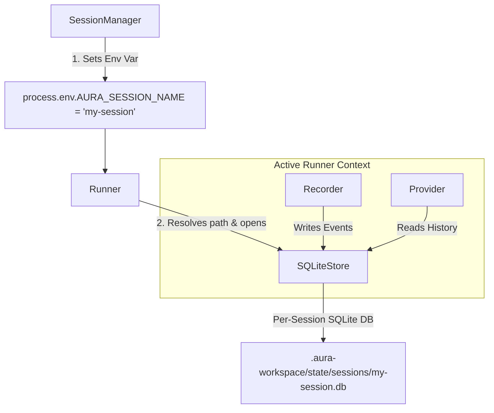

# Session Architecture

Technical design of Aura's session isolation system.

---

## Design Decision: Filesystem as Abstraction

### Why "One Session, One DB"?

**Advantages:**
- Simple and direct, natural isolation
- Each session can be independently backed up/deleted/migrated
- No complex multi-tenant logic needed
- SQLite files are small (typically < 10MB)

**Disadvantages:**
- Cross-session queries require opening multiple DBs (but rarely needed)
- Global search slightly slower (but can use index files)

---

## Architecture Layers

```
┌─────────────────────────────────────────────────────────┐
│            Application Layer (Session Management)        │
│                                                         │
│  SessionManager                                         │
│  - create("research-task")                              │
│  - activate("research-task")                            │
│  - list()                                               │
│  - delete("old-session")                                │
│  - duplicate("experiment-a", "experiment-b")            │
│  - export/import (backup/restore)                        │
│                                                         │
│  Storage: .aura-workspace/state/sessions.json (metadata) │
│           .aura-workspace/state/sessions/*.db (actual data) │
└────────────────────┬────────────────────────────────────┘
                     │
                     ▼
┌─────────────────────────────────────────────────────────┐
│              Runner API (Session-Unaware)                 │
│                                                         │
│  runner = new Runner(projectPath)                       │
│  - Runner knows which DB to operate via env vars        │
│  - process.env.AURA_SESSION_NAME = "research-task"      │
│  - or process.env.AURA_STATE_DB_PATH = "/path/to/db"    │
│                                                         │
│  Runner responsibilities:                                │
│  - observe() → read context from current DB              │
│  - plan() → write plan event to current DB               │
│  - execute() → write execution event to current DB       │
└────────────────────┬────────────────────────────────────┘
                     │
                     ▼
┌─────────────────────────────────────────────────────────┐
│              State (Database Layer)                       │
│                                                         │
│  sqliteStore = new SQLiteStore(dbPath)                  │
│  - Reads process.env.AURA_STATE_DB_PATH or               │
│    process.env.AURA_SESSION_NAME to determine DB path   │
│  - .aura-workspace/state/sessions/{session_name}.db     │
│                                                         │
│  Provided API:                                           │
│  - recordEvent(payload)                                 │
│  - getRecentEvents()                                    │
│  - metabolizeIfNeeded()                                 │
└────────────────────┬────────────────────────────────────┘
                     │
                     ▼
┌─────────────────────────────────────────────────────────┐
│         Environment Provider (Cross-Session Config)       │
│                                                         │
│  Stored in .aura-workspace/config/ or environment variables:       │
│  - User preferences                                      │
│  - Project conventions                                   │
│  - Tool configurations                                   │
│  - API keys (via .env)                                   │
│                                                         │
│  Does not depend on specific session DB, shared by all   │
└─────────────────────────────────────────────────────────┘
```

---

## Environment Contract

Sessions work through environment variables:

```typescript
process.env.AURA_SESSION_NAME = "research-task";
// or
process.env.AURA_STATE_DB_PATH = "/path/to/custom.db";
```

The Runner automatically detects and uses the active session via these variables, keeping layers decoupled.

---

## Data Isolation Guarantees

### Complete Session Isolation

```typescript
// Session A
sessions.activate("session-a");
const runnerA = new Runner(projectPath);
await runnerA.run("Analyze the codebase");
// → All events stored in .aura-workspace/state/sessions/session-a.db

// Session B
sessions.activate("session-b");
const runnerB = new Runner(projectPath);
await runnerB.run("Write documentation");
// → All events stored in .aura-workspace/state/sessions/session-b.db

// Two sessions' data are completely independent
// Session A cannot see Session B's events
// Session B cannot see Session A's events
```

### Verification

```typescript
import Database from 'better-sqlite3';

const dbA = new Database(".aura-workspace/state/sessions/session-a.db");
const dbB = new Database(".aura-workspace/state/sessions/session-b.db");

const countA = dbA.prepare("SELECT COUNT(*) as count FROM events").get().count;
const countB = dbB.prepare("SELECT COUNT(*) as count FROM events").get().count;

console.log(`Session A: ${countA} events`);
console.log(`Session B: ${countB} events`);
// Two counts are independent
```

---

## Performance Considerations

### SQLite File Sizes

- **Empty session**: ~50KB (schema only)
- **100 conversations**: ~2-5MB
- **1000 conversations**: ~20-50MB
- **After metabolism**: < 10MB (old events replaced by summaries)

### Multi-Session Overhead

```typescript
// 10 sessions total size
10 * 5MB = 50MB  // Completely acceptable

// Session switch time
< 10ms  // SQLite file opening is very fast
```

---

## Relationship with Recorder & Provider



---

## File Structure

```
project/
├── .aura-workspace/
│   ├── config/
│   │   └── config.yml              # Environment Provider (cross-session)
│   ├── .env                        # API keys (cross-session)
│   └── state/
│       ├── sessions.json               # Session metadata
│       ├── active_session.txt          # Currently activated session name
│       └── sessions/
│           ├── default.db              # Default session
│           ├── research-task.db        # Research task session
│           ├── code-review.db          # Code review session
│           └── experiment-abc.db       # Experiment branch session
│
└── ...
```

---

## Future Extensions

### 1. Session Tags and Search

```typescript
sessions.create("bug-fix", { tags: ["bug", "auth"] });
sessions.create("feature", { tags: ["feature", "payment"] });

// Search by tag
const bugSessions = sessions.list().filter(s => s.tags.includes("bug"));
```

### 2. Session Merging (Advanced)

```typescript
// Merge insights from two related sessions
sessions.merge("experiment-a", "experiment-b", "merged-insights");
```

### 3. Session Templates

```typescript
// Create session from template (preset configuration)
sessions.createFromTemplate("new-feature", { template: "standard-dev-workflow" });
```

---

## Summary

**SessionManager provides:**
- ✅ Simple "one-session-one-DB" abstraction
- ✅ Complete lifecycle management (create/switch/delete/backup)
- ✅ Natural data isolation
- ✅ Fully compatible with existing Runner/State

**Rationale for not virtualizing DB:**
- ✅ Filesystem is natural multi-tenant
- ✅ Each session completely independent
- ✅ Easy to understand and maintain
- ✅ Backup/migration extremely simple

**Environment Provider handles:**
- ✅ Cross-session configuration (user preferences, project conventions)
- ✅ Does not depend on specific session
- ✅ Shared by all sessions

This is a **concise, practical, and easily extensible** design!

---

## Code References

- **SessionManager**: `src/core/memory/sessionManager.ts`
- **SQLiteStore**: `src/core/memory/sqliteStore.ts`
- **Tests**: `tests/integration/memory.test.ts`

---

## See Also

- [Manage Sessions](../how-to/manage-sessions.md) - Session management for users
- [Context & State](context-and-state.md) - State management
- [Architecture Overview](architecture.md) - System design
