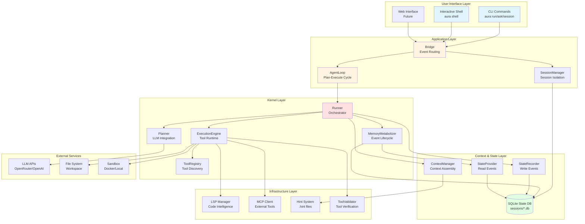
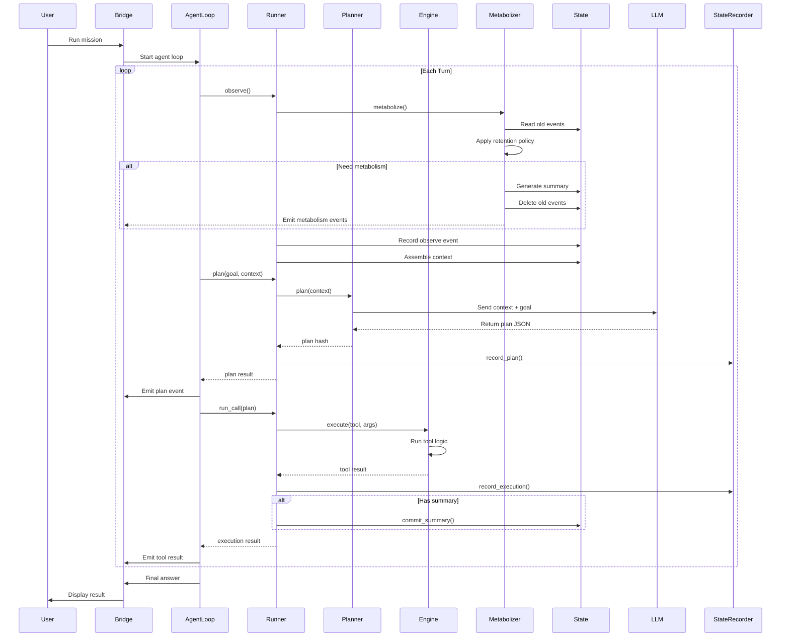
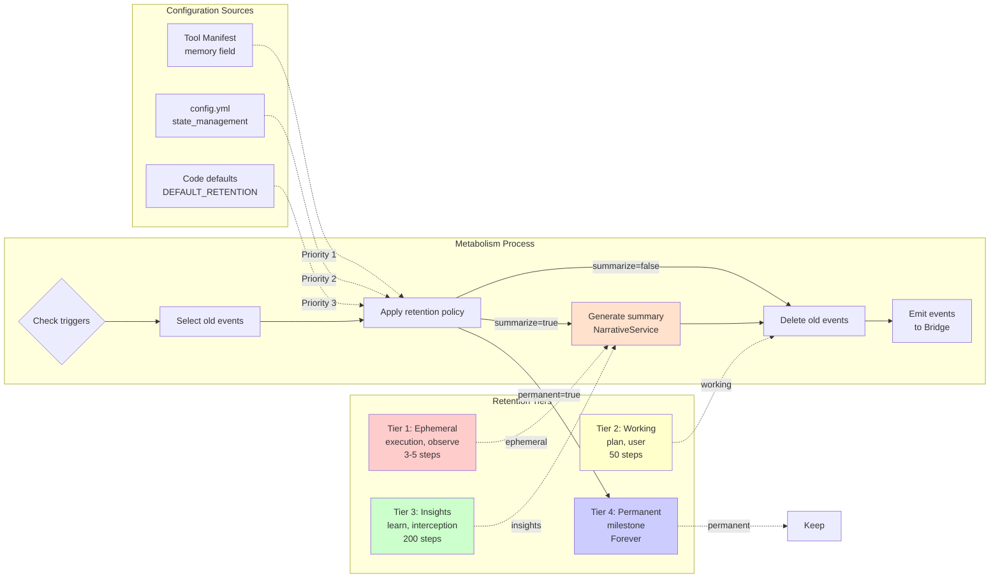
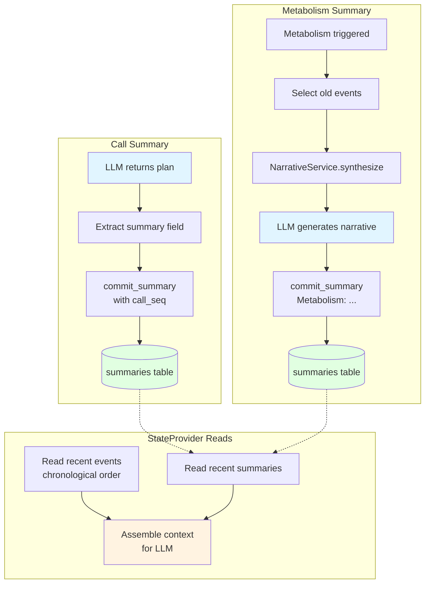
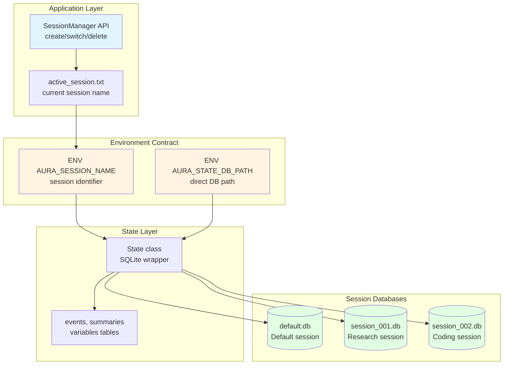
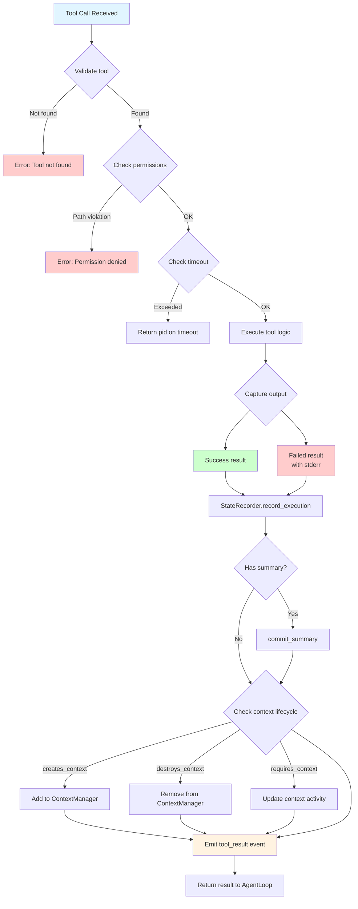

# Aura Framework Architecture

## Scope & Paths

This documentation describes the internal architecture of the **Aura Framework** (the Ruby gem code in this repository).
- **Framework Root**: The root of this repository (`/Users/frank/Desktop/Towards AGI/aura/aura`).
- **Generated Project**: The directory created by `aura new <project_name>`.
- **Docs Location**: All internal implementation docs are located in `docs/internals/`.

---

## 🏗️ Complete Architecture Overview

### High-Level System Architecture

---

### Agent Loop - Plan-Execute Cycle

---

### Memory Metabolism System

---

### Two Types of Summaries

---

### Session Isolation Architecture

---

### Tool Execution Pipeline

---

## Module Map

The framework documentation is organized by functional modules rather than implementation languages.

### 1. [Kernel & Execution](KERNEL.md)
The core runtime engine that orchestrates the agent's lifecycle.
- **Execution Engine**: `Aura::Kernel::Runner` lifecycle (Observe -> Plan -> Execute -> Learn).
- **Tool Protocol**: The "Evolution Loop", tool structure (`logic.py`, `manifest.json`), and validation gates.
- **Memory Retention**: Tool-level memory configuration in manifest.json.
- **Security**: Sandboxing, path isolation, and permission enforcement.
- **Code Reference**: `lib/aura/kernel/`, `lib/aura/cli.rb`.

### 2. [Context & State](CONTEXT.md)
How the agent maintains continuity and memory.
- **State Management**: SQLite schema (`state/sessions/*.db`), event logging, and key-value storage.
- **Read-Write Separation**: StateRecorder (write) vs StateProvider (read).
- **Memory Metabolism**: Tiered retention strategy with manifest-based configuration.
- **Two Summary Types**: Call Summary (from LLM) vs Metabolism Summary (from NarrativeService).
- **Context Assembly**: Building the prompt context from state and environment.
- **Code Reference**: `lib/aura/context/`, `lib/aura/kernel/state.rb`.

### 3. [Session Architecture](SESSION_ARCHITECTURE.md)
Session isolation and management.
- **One Session, One DB**: Each conversation has an isolated SQLite database.
- **Environment Contract**: `ENV["AURA_SESSION_NAME"]` decouples layers.
- **Session Lifecycle**: Create, switch, delete, duplicate, export, import.
- **CLI Integration**: `aura session` commands and `/session` slash command.
- **Code Reference**: `lib/aura/context/session_manager.rb`.

### 4. [Integrations & Protocols](INTEGRATIONS.md)
Interfaces with the external world.
- **Model Context Protocol (MCP)**: Client/Server architecture for connecting to external data sources.
- **Hint System (LSP-lite)**: `.hint` files and `@aura-hint` tags for efficient code sensing.
- **LSP Manager**: Language Server Protocol for code intelligence.
- **Code Reference**: `lib/aura/mcp/`, `lib/aura/extension/`, `lib/aura/ext/lsp/`.

### 5. [Framework Development](TESTING.md)
Guide for contributors to the Aura framework itself.
- **TDD Strategy**: How to run framework tests.
- **Test Matrix**: Coverage of CLI, Generators, Runtime logic, and Memory Retention.
- **Code Reference**: `test/`.

### 6. [Global CLI Setup & PATH Integration](SETUP_AND_CLI.md)
Details on packaging, one-click installation, and global binary resolution.
- **Setup Script**: `bin/setup.sh` automated lifecycle.
- **PATH Resolution**: Gem binaries and version manager shims (`Gem.bindir`).
- **Source Root Check**: Framework pollution protection rules in `entry.rb`.

---

## Key Design Principles

1. **Layered Architecture**: Clear separation between UI, Application, Kernel, Context, and Infrastructure layers
2. **Event-Driven**: All communication through EventBus for loose coupling
3. **Read-Write Separation**: StateRecorder (write) and StateProvider (read) for clean state management
4. **Session Isolation**: Each conversation has its own database for privacy and organization
5. **Tiered Memory**: Different event types have different retention strategies
6. **Configuration-Driven**: Behavior controlled by config.yml and manifest.json, not hardcoded
7. **Tool Evolution**: Tools can be created, validated, tested, and improved by the agent itself

