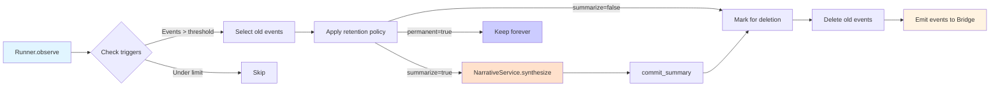

# Context & State Management

## Scope & Paths

This document explains how Aura OS assembles the "Agent Mind" (the prompt) and manages long-term memory.
- **Framework Code**: `lib/aura/context/` (EnvironmentProvider, ToolProvider, StateProvider, StateRecorder, SessionManager).
- **Project Context**: `state/sessions/*.db` (SQLite, session-isolated) and `config/config.yml`.
- **Memory Metabolism**: `lib/aura/kernel/memory_metabolizer.rb`.

---

## 1. Context Assembly Pipeline

The `Aura::Context::Manager` orchestrates three providers to build the prompt:

### A. Environment Provider (`Aura::Context::EnvironmentProvider`)
Scans the project structure to give the agent situational awareness.
- **Workspace Overview**: Lists files and directories (excluding hidden ones).
- **Global Rules**: Injects `AURA_README.md` if present.
- **Skills**: Scans `skills/*.md` frontmatter to list available workflows.

### B. Tool Provider (`Aura::Context::ToolProvider`)
Manages the "Tool Box".
- **Active Tools**: Fully expanded schemas for Core Tools + `auto_load: true` tools.
- **Tool Index**: Compact list (Name + Description) for other tools to save tokens.
- **Status Reporting**: Annotates tools with `[ACTIVE]`, `[failed]`, etc.
- **MCP Integration**: Merges external tools (`mcp.*`) into the list.

### C. State Provider (`Aura::Context::StateProvider`)
Connects to SQLite (`state/sessions/*.db`) to retrieve history.
- **Recent Events**: The last N raw interactions in **chronological order** (Phase, Tool, Payload, Thought).
- **Summaries**: High-level narrative of older history (both Call Summaries and Metabolism Summaries).
- **Variables**: Persistent Key-Value store (e.g., user preferences).

---

## 2. Read-Write Separation Pattern

Aura implements a clean separation between state reading and writing:

### StateRecorder (Write Side)
- **Location**: `lib/aura/context/state_recorder.rb`
- **Purpose**: Type-safe event recording interface
- **Methods**:
  - `record_user(input)` - Record user input
  - `record_plan(plan_hash)` - Record LLM plan with tool, args, summary, thought
  - `record_execution(tool, result)` - Record tool execution results
  - `record_interception(tool, advice)` - Record tool halts
  - `record_custom(phase, payload)` - Record custom events

### StateProvider (Read Side)
- **Location**: `lib/aura/context/state_provider.rb`
- **Purpose**: Format events for LLM context
- **Features**:
  - Returns events in **chronological order** (not grouped by layers)
  - Extracts and prioritizes `thought` field from plan events
  - Includes both call summaries and metabolism summaries
  - Applies context compression if needed

---

## 3. Session-Isolated State

Each conversation (session) has its own isolated SQLite database:

### Architecture
```
state/
├── active_session.txt          # Current session name
├── sessions/
│   ├── default.db              # Default session
│   ├── session_001.db          # Research session
│   └── session_002.db          # Coding session
└── aura.db                     # (Legacy, auto-migrated)
```

### Environment Contract
- `ENV["AURA_SESSION_NAME"]` - Session identifier
- `ENV["AURA_STATE_DB_PATH"]` - Direct DB path (overrides session name)

### SessionManager API
- `create(name)` - Create new session
- `activate(name)` - Switch to session
- `delete(name)` - Delete session
- `duplicate(source, target)` - Copy session
- `export(name)` - Export session
- `import(path)` - Import session

See [SESSION_ARCHITECTURE.md](SESSION_ARCHITECTURE.md) for details.

---

## 4. Memory Metabolism System

### Tiered Retention Strategy

Aura implements a sophisticated memory metabolism system with 4 retention tiers:

| Tier | Name | Events | Retention | Summarize |
|------|------|--------|-----------|-----------|
| 1 | Ephemeral | execution, observe | 3-5 steps | ✅ Yes |
| 2 | Working | plan, user | 50 steps | ❌ No |
| 3 | Insights | learn, interception | 200 steps | ✅ Yes |
| 4 | Permanent | milestone | Forever | ❌ No |

### Configuration Sources (Priority Order)

1. **Tool Manifest** (highest priority)
   ```json
   {
     "name": "bash_command",
     "memory": {
       "retention": "ephemeral",
       "summarize": true,
       "max_steps": 5
     }
   }
   ```

2. **Global Config** (`config.yml`)
   ```yaml
   state_management:
     retention:
       execution: { max_steps: 10, summarize: true }
   ```

3. **Code Defaults** (`MemoryMetabolizer::DEFAULT_RETENTION`)

### Metabolism Process



### MemoryMetabolizer Class
- **Location**: `lib/aura/kernel/memory_metabolizer.rb`
- **Called from**: `Runner.observe()` before context assembly
- **Event Bus**: Emits `:metabolism_start`, `:metabolism_summary`, `:metabolism_complete`
- **Registry Integration**: Reads manifest `memory` field for tool-specific retention

---

## 5. Two Types of Summaries

Aura uses two distinct summary mechanisms:

### Call Summary (工具调用摘要)
- **Source**: LLM returns `summary` field in tool call response
- **Timing**: Every tool execution
- **Config**: `tool_protocol.call_summary.*`
- **Purpose**: Quick record of "what agent did"
- **Example**: `"读取配置文件检查数据库设置"`

### Metabolism Summary (代谢总结)
- **Source**: NarrativeService calls LLM to generate narrative
- **Timing**: When metabolism is triggered (events exceed threshold)
- **Config**: `state_management.summarization.*`
- **Purpose**: Compress old events into concise narrative
- **Example**: `"Agent read config.yml, attempted to write test.rb but failed due to syntax error, then fixed and verified."`

See [TWO_TYPES_OF_SUMMARIES.md](TWO_TYPES_OF_SUMMARIES.md) for complete comparison.

---

## 6. Context Compression

When assembling the prompt at runtime, if the total length exceeds `max_state_chars`, Aura applies multi-tiered compression:

1. **Event-level Payload Truncation**: Truncates raw event payloads > `event_max_chars` (default 800)
2. **Event Count Reduction**: Trims older events down to `event_min_count_threshold` (default 10)
3. **Section Discarding**: Drops less critical sections based on `drop_order`
4. **Extreme History Trim**: Drops history down to single latest event

*Note: Persistent Facts (`:knowledge`) and core Agent Memory structures are preserved.*

---

## 7. Database Schema (SQLite)

Each session database contains:

### events table
- `id` - Auto-increment primary key
- `timestamp` - Unix timestamp
- `phase` - Event phase (user/plan/execution/observe/learn/interception)
- `tool` - Tool name (nullable)
- `payload` - JSON payload with event details

### summaries table
- `id` - Auto-increment primary key
- `timestamp` - Unix timestamp
- `content` - Summary text
- `source_event_id` - Link to originating event (for Call Summaries)

### variables table
- `key` - Primary key (string)
- `value` - JSON/Text value

### undone_events & undone_summaries tables
- Support undo/redo functionality
- Mirror structure of events and summaries tables

---

## 8. Configuration Reference

### state_management (config.yml)
```yaml
state_management:
  max_state_chars: 100000           # Trigger metabolism at this char count
  recent_events_n: 20               # Keep this many recent events
  keep_last_summary_n_steps: 20     # Keep this many recent summaries
  
  summarization:
    enabled: true
    max_chars: 500                  # Max length for metabolism summaries
    model: "gpt-4o"                 # Optional: specific model for summaries
    focus_on:                       # Summary focus areas
      - "key_files_modified"
      - "critical_test_results"
      - "blockers_encountered"
      - "cumulative_result"
  
  retention:
    execution: { max_steps: 5, summarize: true }
    observe: { max_steps: 3, summarize: false }
    plan: { max_steps: 50, summarize: false }
    user: { max_steps: 100, summarize: false }
    learn: { max_steps: 200, summarize: true }
    interception: { max_steps: 100, summarize: false }
    milestone: { permanent: true }
```

### tool_protocol.call_summary (config.yml)
```yaml
tool_protocol:
  call_summary:
    suggested_chars: 120            # Suggested summary length for LLM
    max_chars: 256                  # Max summary length (truncate if exceeded)
    attach_max_chars: 1024          # (Deprecated: removed)
```

### memory field (manifest.json)
```json
{
  "memory": {
    "retention": "ephemeral",
    "summarize": true,
    "max_steps": 5,
    "permanent": false,
    "description": "Optional human-readable description"
  }
}
```

