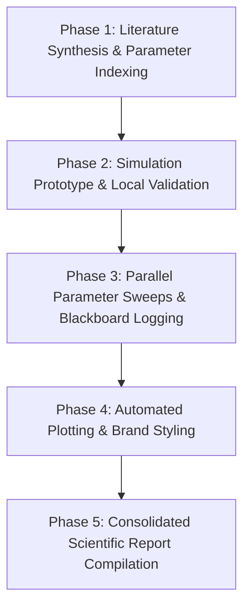

# Aura Garden: Scientific Research & Simulation Playbook

This playbook outlines a structured research pipeline on Aura OS. It is designed around the decoupling of **engineering** (setting up the workspace environment, indexing constants/equations, and establishing a baseline execution prototype) and **science** (running parameter searches and sweeps to test hypotheses). Under this approach, the core math solver engine and simulation infrastructure (Phase 1 & Phase 2) are verified and locked first, ensuring a stable, correct foundation for subsequent exploratory sweep runs (Phase 3 & Phase 4) in parameterized subagent sandboxes.

## Workflow Overview
Research pipelines translate theory to code, run sweeps, and output figures:



---

## Playbook Steps

### Phase 1: Literature Synthesis & Parameter Indexing
1. Download academic papers, specifications, or datasets into `knowledge/`.
2. **Catalog Files with Hints**: Create a companion `.hint` file for each paper (e.g. `knowledge/paper_name.pdf.hint`) listing:
   - Key equations and models.
   - Initial conditions and constant parameters.
   - Target simulation variables.
   - This ensures the agent is aware of document contents without reading large files repeatedly.

### Phase 2: Simulation Prototype & Local Validation
1. Custom modular prompts: Edit `prompts/system/SOUL.md` (or `.aura/prompts/system/SOUL.md` — both paths are scanned) to define a rigorous scientific persona, and specify plot formatting preferences (e.g., HSL tailored color palette, Outfit font) in `prompts/system/USER.md`.
2. Write a single-run prototype script (e.g. `src/simulate_once.py`) using the extracted parameters.
3. Run the prototype locally with a single parameter set to verify the logic runs without crashing. Do not spawn sweeps yet.

### Phase 3: Parallel Parameter Sweeps & Blackboard Logging
- **Scientific Exploration Sandbox**: Limit the scope of parallel subagents to sweeping parameter spaces using the frozen baseline prototype script. Do not allow subagents to edit base physical equations or solver engines.
- **Context Management**: Sweep simulations write massive logs. Keep raw output CSV files in `state/simulation_runs/` to prevent bloating the LLM context.
- **Agent Architecture**:
  - *Light sweeps*: Use a simple Python script loop in the main workspace.
  - *Heavy sweeps*: Spawn parallel subagents via the `subagent` tool (max_steps: 40-50). Instruct subagents to write results to the **Shared Blackboard Bus** (`state/bus/`).
- Example subagent dispatch (use `async_mode: true` to run multiple sweeps in parallel):
  ```json
  {
    "subagent_id": "sweep_alpha_beta",
    "persona": "coder",
    "goal": "Execute simulation sweeps for alpha=0.1..0.5 and beta=1.0..2.0. Output outcomes as CSV to state/simulation_runs/sweep_ab.csv. Write a summary dict to blackboard key: sweep_ab_summary",
    "async_mode": true,
    "max_steps": 45
  }
  ```
- ⚠️ **Wait for completion**: After dispatching async subagents, poll each returned `job_id` using the `subagent` tool before proceeding to Phase 4. Starting the plotting phase before sweeps complete will produce empty or partial CSVs.

### Phase 4: Automated Plotting & Brand Styling
1. Write or invoke a visualization script (e.g., `src/plot_results.py`) to read the sweep CSVs.
2. Add an `@aura-hint:` annotation at the **top of `src/plot_results.py`** (not inside an output directory — `assets/`, `build/`, `dist/` are excluded from hint scanning):
   ```python
   # @aura-hint: Plotting script. Always read CSVs from state/simulation_runs/. Output figures to assets/. Use Outfit font and brand HSL color palette for all plots.
   ```
3. Verify the generated plots exist under `assets/` and are correctly rendered.

### Phase 5: Consolidated Scientific Report Compilation
1. Read consolidated sweep summaries from the blackboard (keys are plain strings, e.g. `sweep_ab_summary`) or by reading CSV files in `state/simulation_runs/`. Note: `state/` is excluded from the `@aura-hint:` scanner and is never auto-loaded into context — always read its contents explicitly with `read_file`.
2. Write the final scientific summary to `research_report.md` including:
   - Abstract & target goal.
   - Extracted model parameters.
   - Tabulated sweep outputs.
   - Embedded figure references (``).
3. **Blackboard Cleanup**: Once the report is written and verified, delete the temporary blackboard keys to avoid cluttering subsequent runs:
   ```json
   { "action": "delete", "key": "sweep_ab_summary" }
   ```

### Troubleshooting & Failure Recovery
- **Failed Subagent Sweeps**: If a subagent sweep fails, do not proceed to plotting. Inspect the subagent's execution trajectory under `state/subagents/{parent_id}/{child_id}/trajectory.txt` to diagnose issues (e.g., convergence failures, parameter out of bounds, library missing).
- **Incomplete Sweeps**: If some sweep tasks timeout, use the blackboard or temporary CSVs to identify which parameter sets are missing, adjust the step limits/timeouts, and rerun only the missing sweeps.
- **Corrupted Plots**: If the visualization script crashes, check that all CSV files in `state/simulation_runs/` are fully written and not truncated. Empty files should be removed and the corresponding sweep rerun.
