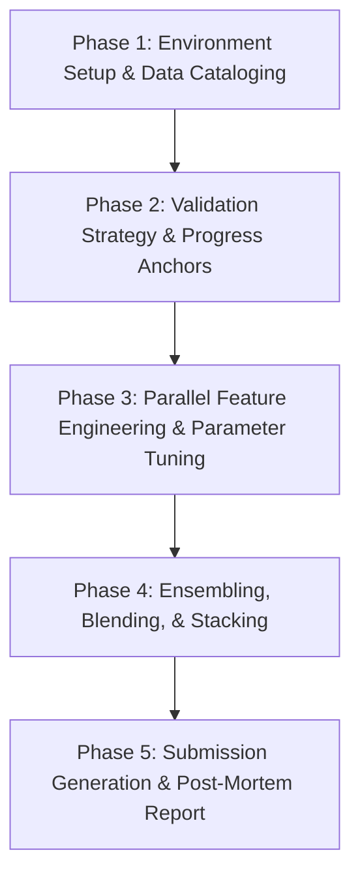

# Aura Garden: Kaggle Competition & Machine Learning Playbook

This playbook outlines a structured, iterative machine learning engineering pipeline on Aura OS. It is designed around the decoupling of **engineering** (establishing and verifying a robust, reproducible data loader and validation garden) and **science** (iterating on features, model architecture, and hyperparameters). Under this approach, the engineering infrastructure (Phase 1 & Phase 2) is built and frozen first, ensuring a stable, unchanging foundation for subsequent scientific exploration (Phase 3 & Phase 4) in designated sandbox files.

## Workflow Overview
A Kaggle competition pipeline transitions from data analysis to robust local validation, feature exploration, parallel modeling, and ensembling:



---

## Playbook Steps

### Phase 1: Environment Setup & Data Cataloging
1. Install core ML libraries (`pandas`, `numpy`, `scikit-learn`, `lightgbm`, `xgboost`, `catboost`, `optuna`, `torch`) via the package manager or setup script.
2. Custom modular prompts:
   - Edit `prompts/system/SOUL.md` (or `.aura-workspace/prompts/system/SOUL.md` / `.aura/prompts/system/SOUL.md` — these paths are scanned) to define a competitive, analytical Machine Learning Expert persona.
   - Edit `prompts/system/TOOLS.md` to specify hardware/GPU constraints, memory usage rules, and output path boundaries.
3. Unpack competition datasets under `data/raw/`. Keep large raw training/test sets out of the system context.
4. **Catalog Files with Data Hints**: Create a companion `.hint` file for each data source (e.g. `data/raw/train.csv.hint`) listing:
   - Row count, number of features, target column, data types.
   - Percentage of missing values and distributions (skewness/kurtosis) of key columns.
   - Identified data leakage vectors or ID-based sorting dependencies.

### Phase 2: Validation Strategy & Progress Anchors
1. **Define Local Validation Folds**: Establish a local cross-validation (CV) strategy (e.g. Stratified K-Fold, Group K-Fold, or Time-Series Split) that mimics the public leaderboard evaluation metric.
2. **Write Validation Garden**: Create `src/validate.py` which trains a baseline model (e.g., Logistic Regression or a small LightGBM) and logs CV scores.
3. **Setup Anchors**: Create step anchors under `anchors/` (e.g., `01_baseline_cv_recorded.json`, `02_features_added.json`, `03_models_tuned.json`, `04_ensemble_built.json`) to track target metrics:
   ```json
   {
     "id": "01_baseline_cv_recorded",
     "call_when": ["Baseline cross-validation score has been printed and recorded in task.md"]
   }
   ```

### Phase 3: Parallel Feature Engineering & Parameter Tuning
- **Scientific Exploration Sandbox**: Adhering to the core philosophy, restrict all experimental iterations to specific files (e.g., `src/features.py`, `src/models.py`) without changing the baseline engineering foundation (`src/validate.py`).
- **Context Management**: Feature generation runs and model logs produce verbose files. Save intermediate models/logs under `state/models/` and `state/features/` (excluded from index & hint scan by default).
- **Agent Architecture**:
   - Spawn subagents to test distinct feature subsets or hyperparameters in parallel:
     - *Subagent 1*: Generates target encoding, aggregations, and interactions.
     - *Subagent 2*: Optimizes LightGBM hyperparameters using Optuna.
     - *Subagent 3*: Trains a neural net baseline (PyTorch/MLP).
   - Use `async_mode: true` to launch them concurrently. Instruct subagents to run `src/validate.py` on their models and log metrics/parameters/feature names to the **Shared Blackboard Bus** (`state/bus/`).
   - Example subagent dispatch:
     ```json
     {
       "subagent_id": "optuna_lgb_sweep",
       "persona": "coder",
       "goal": "Run Optuna sweep on LightGBM hyperparameters. Use src/validate.py to evaluate CV score. Save best parameters to blackboard key: lgb_best_params, and CV score to blackboard key: lgb_best_cv",
       "async_mode": true,
       "max_steps": 50
     }
     ```
- Poll and wait for all async subagents to finish before proceeding.

### Phase 4: Ensembling, Blending, & Stacking
1. Retrieve best model configurations, CV scores, and out-of-fold (OOF) predictions from the blackboard:
   ```json
   {
     "action": "read",
     "key": "lgb_best_cv"
   }
   ```
2. Write an ensembling script `src/ensemble.py` to combine predictions (simple average, weighted average, or ridge regression meta-model stacking).
3. Validate ensemble CV: ensure it improves upon the single best model score. If it regresses, adjust blending weights or prune low-performing models.
4. Generate diagnostic plots (e.g., correlation heatmaps of model predictions, feature importance plots) under `assets/`.
5. Annotate `src/ensemble.py` with `@aura-hint:` comment tag:
   ```python
   # @aura-hint: Ensembling module. Ensure all source prediction arrays are aligned on row IDs. Log final ensemble CV metrics to task.md and output figures to assets/.
   ```

### Phase 5: Submission Generation & Post-Mortem Report
1. Run final inference on the test set using the ensemble weights. Write the outputs to `submission.csv`.
2. Format/structure check: verify `submission.csv` matches the raw test file row count and expected header columns.
3. Write a Kaggle run summary to `kaggle_report.md`:
   - Competition goal & evaluation metric.
   - Cross-validation scheme and local baseline vs. final CV scores.
   - List of key features and their impact.
   - Ensemble model list and blending weights.
4. **Blackboard Cleanup**: Delete temporary keys from the blackboard:
   ```json
   {
     "action": "delete",
     "key": "lgb_best_params"
   }
   ```

### Troubleshooting & Failure Recovery
- **GPU Out-of-Memory (OOM)**: PyTorch or XGBoost training may fail due to GPU RAM limits. Adjust batch sizes down or enable mixed-precision training (`fp16`). Instruct the agent to run garbage collection (`gc.collect()`, `torch.cuda.empty_cache()`) between folds.
- **Data Leakage**: If local CV score is exceptionally high (e.g., 0.999 AUC) but public leaderboard or baseline test is poor, inspect for feature leakage (e.g., using target values inside feature extraction, or using future data in time-series splits).
- **Subagent Failures**: If a tuning sweep fails to report results, check the subagent's trajectory log under `.aura-workspace/state/subagents/{parent_id}/{child_id}/trajectory.txt` (or `.aura/...` fallback). Verify if libraries were missing or convergence/evaluation criteria failed.
