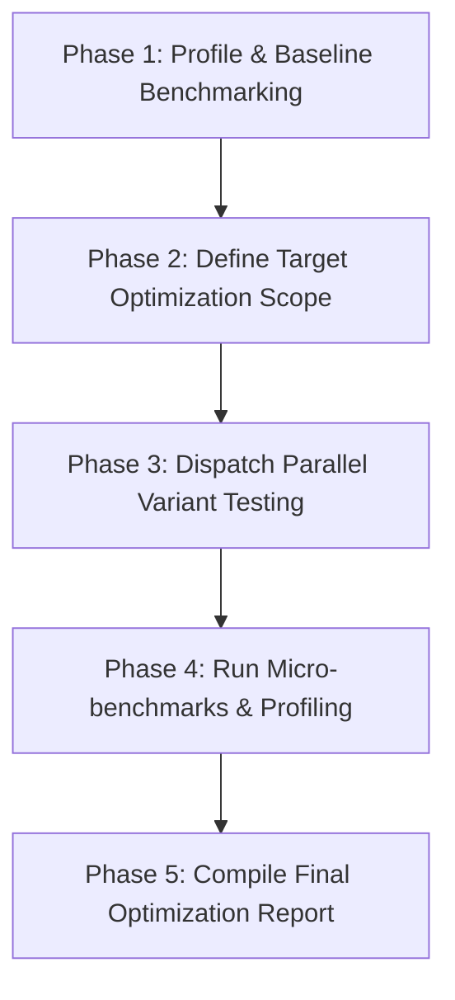

# Aura Garden: Performance Tuning & Benchmarking Playbook

This playbook outlines a structured performance optimization pipeline on Aura OS. It is designed around the decoupling of **engineering** (setting up reproducible benchmark harness scripts and system profiles) and **science/exploration** (iterating on optimization variants and micro-benchmarks). Under this approach, the baseline benchmarking infrastructure (Phase 1 & Phase 2) is verified first and kept frozen, ensuring that subsequent exploratory performance experiments (Phase 3 & Phase 4) are evaluated objectively against an unchanging target.

## Workflow Overview
A performance tuning pipeline transitions from baseline profiling to micro-benchmarking, parameter exploration, and verification:



---

## Playbook Steps

### Phase 1: Profile & Baseline Benchmarking
Before making any optimizations, establish a reliable, noise-isolated baseline:
1. Identify performance hotspots using profilers (e.g., Ruby's `stackprof`, Python's `cProfile`, or Node's `--cpu-prof`).
2. **Write Baseline Benchmark**: Create a script (e.g., `src/benchmark.py`) that runs a repeatable workload and prints execution times, CPU usage, and memory usage.
3. Run the baseline benchmark 5-10 times and record the median and variance of the execution time in `task.md`.

### Phase 2: Define Target Optimization Scope
1. Custom modular prompts:
   - Edit `prompts/system/SOUL.md` (or `.aura-workspace/prompts/system/SOUL.md` / `.aura/prompts/system/SOUL.md` — these paths are scanned) to define a meticulous, detail-oriented Performance Engineer persona.
   - Edit `prompts/system/TOOLS.md` to specify CPU pinning, memory limit rules, and profiling constraints.
2. Annotate the target optimization module using `@aura-hint:` comment tag:
   ```python
   # @aura-hint: Performance optimization target. Ensure all patches preserve algorithmic correctness and have no side effects. Keep memory usage within 512MB.
   ```

### Phase 3: Dispatch Parallel Variant Testing
- **Scientific Exploration Sandbox**: Restrict code optimizations to specific target files/functions. Never relax correctness tests or baseline benchmark configurations.
- Spawn subagents to test distinct optimization strategies in parallel (e.g., algorithm optimization, caching, parallel processing/threading, memory reuse):
  - *Subagent 1*: Implements memoization/caching.
  - *Subagent 2*: Rewrites inner loops in a more vectorized or compiled way.
  - *Subagent 3*: Implements concurrency/parallelism.
- Instruct subagents to run `src/benchmark.py` on their variants and report execution times and memory usage to the **Shared Blackboard Bus** (`state/bus/`):
  - Example:
    ```json
    {
      "subagent_id": "cache_optimization",
      "persona": "coder",
      "goal": "Implement caching in src/core/parser.ts and run src/benchmark.ts. Log the median execution time and memory usage to blackboard key: opt_cache_results",
      "async_mode": true,
      "max_steps": 45
    }
    ```

### Phase 4: Run Micro-benchmarks & Profiling
1. Retrieve best variant configurations and execution times from the blackboard.
2. Run micro-benchmarks on the top 2 variants side-by-side.
3. Ensure optimizations do not introduce regressions in edge cases or memory leaks.

### Phase 5: Compile Final Optimization Report
1. Write the final performance report to `perf_report.md` including:
   - Profiling findings (hotspots).
   - Baseline performance metrics.
   - Optimization variants tested and their comparative benchmark results.
   - Final selected patch and the total speedup factor.
2. Clean up temporary blackboard keys.
