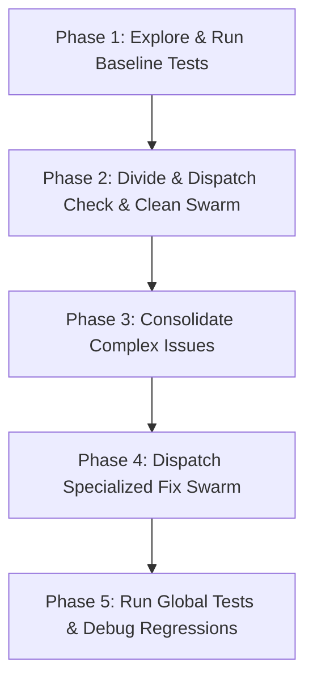

# Aura Garden: Codebase Static Check & Repair Playbook

This playbook outlines a stateful, multi-agent pipeline for static code checking, test verification, and automated bug-fixing on Aura OS. It is designed around the decoupling of **engineering** (establishing and freezing the baseline test suites and static code check frameworks) and **science/exploration** (iterating on bug-fixing patches and refactoring). Under this approach, the verification garden (Phase 1) is verified first and kept frozen, ensuring that subsequent exploratory patch swarms (Phase 2 to Phase 4) are evaluated objectively against an unchanging target.

## Workflow Overview
The process is divided into 5 logical phases:



---

## Playbook Steps

### Phase 1: Explore & Run Baseline Tests
Before running any audits or spawning subagents, establish a clear baseline:
1. Locate source code directories (e.g., `src/`, `lib/`) and testing suites (e.g., `tests/`, `test/`).
2. **Run Baseline Tests**: Execute the primary test command (e.g. `npm test`, `pytest`) to ensure the codebase is not already broken. If baseline tests fail, log the errors immediately as pre-existing issues.
3. **Verify Test Completeness**: Scan test files to check if critical modules have test coverage. Mark any untested modules in `task.md`.

### Phase 2: Divide & Dispatch Check & Clean Swarm
Divide the codebase into logical modules and dispatch subagents.
- **Repair Exploration Sandbox**: Confine all exploratory code edits to target modules and implementation files. Do not modify the test assertions or check frameworks to bypass diagnostics.
- **Pragmatic Rule**: Checker agents should **directly fix** trivial style issues, unused imports, or simple formatting errors on the spot to preserve context. Only complex, structural bugs should be logged for Phase 4.
- **Realistic Step Budget**: Spawning subagents with very low step limits (e.g., 5-10) will cause execution timeouts because observation and correction require multiple tool cycles. Provide a realistic budget of **30 to 50 steps**.
1. Create step anchors under `anchors/` (e.g. `01_check_core.json`) to track progress. Each anchor file must follow this structure:
   ```json
   { "id": "01_check_core", "call_when": ["src/core/ has been scanned and trivial issues fixed"] }
   ```
2. Spawn checking subagents using the `subagent` tool. Use `async_mode: true` to run multiple checks in parallel:
   - Example:
     ```json
     {
       "subagent_id": "check_and_clean_core",
       "persona": "auditor",
       "goal": "Scan src/core/ for code quality. Directly fix simple style/lint issues. Log complex structural errors or missing test templates to blackboard key: report_core",
       "async_mode": true,
       "max_steps": 40
     }
     ```

### Phase 3: Consolidate Complex Issues
1. Wait for all async subagents to complete. Poll status using the `job_id` returned by each `subagent` call if `async_mode` was used.
2. Read all report slots from the blackboard. Keys are plain strings — use `report_core`, **not** `report_core.json`:
   ```json
   { "action": "read", "key": "report_core" }
   ```
3. Merge findings into a centralized `compliance_report.md` file, listing:
   - **Trivial Fixes**: Summarize what was already cleaned up in Phase 2.
   - **Complex Flaws**: Structural bugs, potential memory leaks, or missing tests that require specialized debugging.

### Phase 4: Dispatch Specialized Fix Swarm
1. **Pre-Fix Snapshot**: Ensure `security.git_snapshots: true` is configured in `.aura/config/config.yml` or make a manual git commit to establish a rollback checkpoint.
2. Spawn coder subagents targeting the complex flaws in `compliance_report.md`:
   - **Continuous Local Testing**: Patcher agents must run Vitest/tests *within their own subagent loops* to verify their changes before reporting success.
   - Example:
     ```json
     {
       "subagent_id": "fix_core_complex",
       "persona": "coder",
       "goal": "Read blackboard key report_core, fix the structural errors in src/core/, and verify the fixes by running the corresponding tests locally. Do not report success if local tests fail.",
       "max_steps": 50
     }
     ```

### Phase 5: Run Global Tests & Debug Regressions
1. Run the primary global test command (e.g., `npm test`).
2. If tests fail:
   - Parse the exact error messages.
   - Spawn a debugging subagent targeting only the failing test suite to prevent context bloat:
     ```json
      {
        "subagent_id": "repair_test_regression",
        "persona": "debugger",
        "goal": "Analyze the failure of the failing test file (e.g. test_a.test.ts) and patch the regression. Ensure the test passes locally before returning.",
        "max_steps": 35
      }
     ```
3. Verify that the final git diff is clean, logical, and all tests pass.
